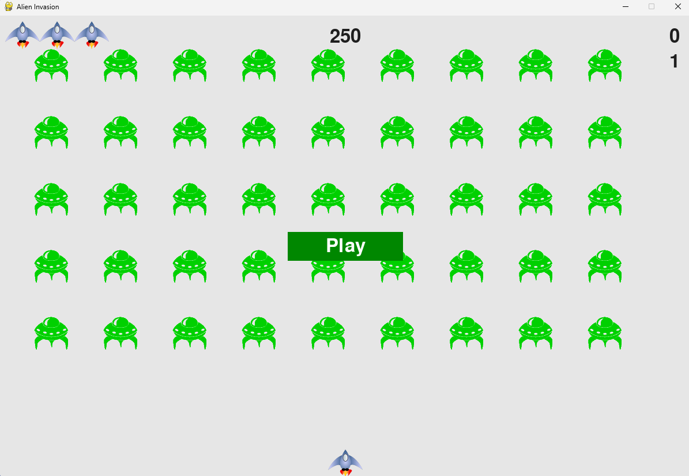

# 👾 Alien Invasion (Pygame Edition)

A classic arcade-style shooting game built with [Pygame](https://www.pygame.org/). You control a spaceship and try to shoot down waves of aliens before they reach the bottom of the screen.

---

## 📸 Screenshot

<p align="center">
  
</p>

<p align="center"><i>Main menu screen of the game</i></p>

---

## 🎮 Features

- Player-controlled spaceship with left/right movement
- Bullet shooting system with collision detection
- Multiple rows of alien enemies moving in formation
- Score tracking and game over condition
- Classic "arcade feel" using Python and Pygame

---

## 📦 Requirements

- Python 3.x
- Pygame library

### Install Pygame

```bash
pip install pygame
```
---

## 🚀 Getting Started
### Clone the repository
```bash
git clone https://github.com/Rexthedog28/alien-invasion.git
cd alien-invasion
```
### Run the Game
```bash
python alien_invasion.py
```
---

## 🙌 Acknowledgments
Inspired by the Alien Invasion project from Python Crash Course by Eric Matthes, with personal additions and improvements.

---
